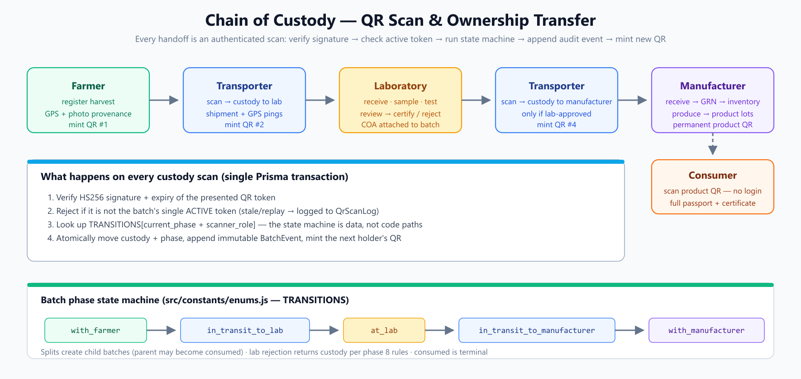
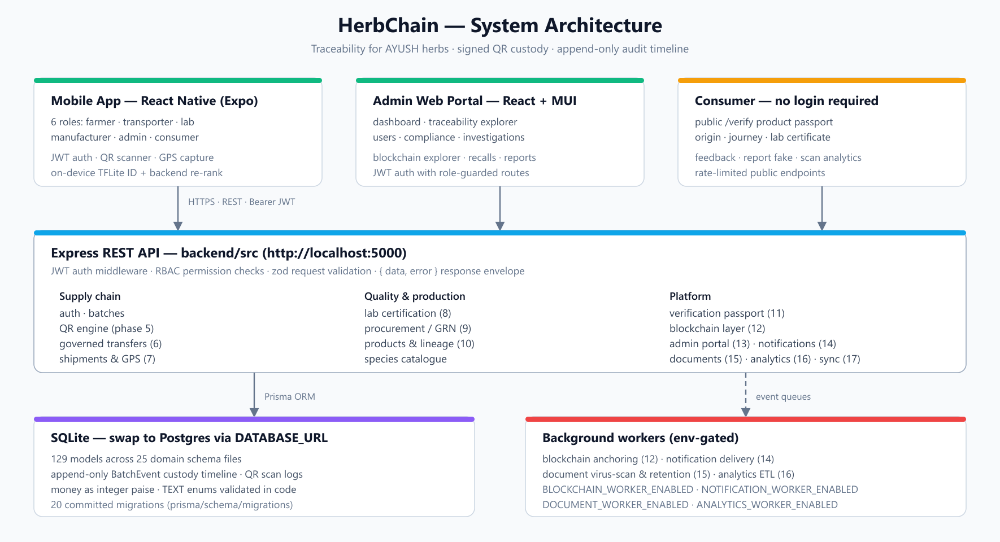
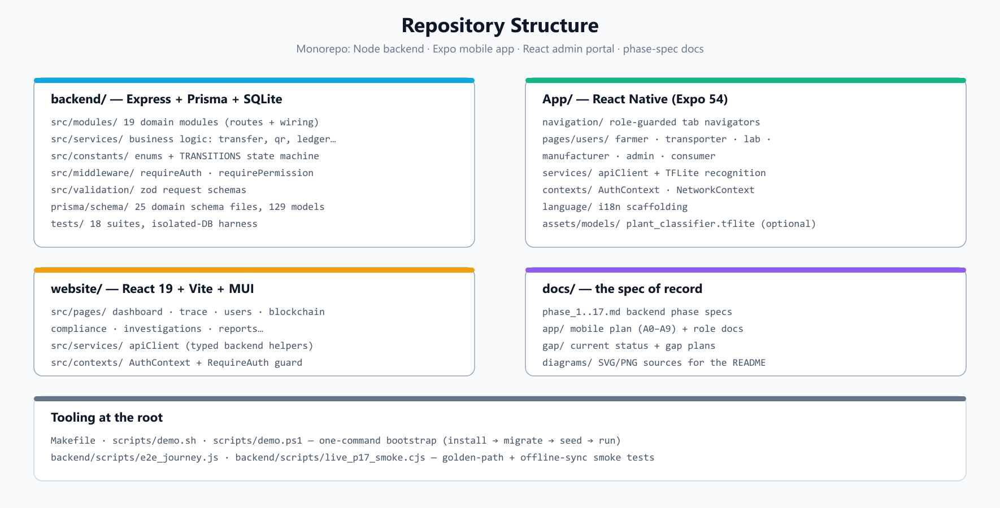

<div align="center">

# 🌿 HerbChain

**End-to-end traceability for AYUSH herbs — from farm to consumer, one signed QR scan at a time.**

Every custody handoff is an authenticated scan that verifies a signed QR token,
invalidates the previous one, atomically transfers ownership, and mints the
next QR — leaving an append-only audit trail that powers consumer-facing
product passports.

[](./.github/workflows/ci.yml)
[](./LICENSE)
[](./backend/package.json)
[](./backend)
[](./CONTRIBUTING.md)

</div>

---

## Why HerbChain

AYUSH (Ayurveda, Yoga & Naturopathy, Unani, Siddha, Homoeopathy) herb supply
chains suffer from **stock manipulation, adulteration, diversion, and zero
consumer transparency**. HerbChain fixes this with a chain of custody that is:

- **Cryptographically signed** — every batch QR is an HMAC-SHA256 JWT; a
  leaked QR dies the moment the next holder scans and a new one is minted.
- **State-machine governed** — ownership can only move along allowed
  `(current_phase, receiver_role)` transitions, and (phase 6) only through a
  two-party request/approve handshake.
- **Append-only auditable** — every fact lands in an immutable `BatchEvent`
  timeline; a permissioned blockchain layer (phase 12) anchors trusted events.
- **Consumer-verifiable** — anyone can scan a product QR (no login) and see
  the origin farm, lab certificate, journey, and manufacturer.



## Architecture

```
Farmer ──QR──▶ Transporter ──QR──▶ Lab ──QR──▶ Transporter ──QR──▶ Manufacturer ──product QR──▶ Consumer
```

- **`backend/`** — Express 4 + Prisma + SQLite REST API (19 domain modules,
  129 models across 25 schema files, ~241 routes). Swap to Postgres by
  changing `DATABASE_URL` — nothing else.
- **`App/`** — React Native (Expo 54) mobile app with role-specific
  navigation for farmers, transporters, labs, manufacturers, admins, and
  consumers. Includes offline-sync support and on-device AI herb recognition.
- **`website/`** — React 19 + Vite + MUI admin portal (the AYUSH regulatory
  control tower): dashboards, traceability explorer, investigations,
  recalls, blockchain explorer.



### What happens on a scan

1. The scanner presents the batch's QR token (HS256 JWT with
   `typ/sub/holder/phase/nonce` claims).
2. Backend verifies signature + expiry, then rejects anything that isn't the
   **single active token** for that batch — stale and replayed tokens are
   logged to `qr_scan_logs` as a tamper signal.
3. The `TRANSITIONS` state machine decides whether
   `(current_phase, scanner_role)` is a legal custody move.
4. Inside one Prisma transaction: custody + phase update, immutable
   `BatchEvent` append, and the next holder's QR minted.

## Feature highlights

| Role | What they get |
| --- | --- |
| **Farmer** | Batch registration with GPS + photo provenance, AI-assisted species ID (on-device TFLite + backend re-rank), 25-species AYUSH catalogue, crop calendar, batch splitting, QR printing, transfer inbox |
| **Transporter** | Trip list, shipment lifecycle (assign → accept → pickup → GPS pings → deliver → POD), delivery failure handling |
| **Lab** | Intake queue, samples, structured tests, two-level review, certificate (COA) issuance, batch rejection |
| **Manufacturer** | Certified-batch marketplace, procurement requests, GRN receiving, inventory with allocations & quality holds, manufacturing runs, product lineage, recall impact analysis |
| **Consumer** | Public `/verify` product passport — origin, journey, lab certificate — plus feedback & fake-reporting, no account needed |
| **Admin** | Regulatory control tower: dashboards, universal search, compliance alerts & scores, investigations, recalls, shipment map, audit trail, blockchain governance |

## Quick start

**Prerequisites:** Node.js ≥ 20, npm. For the mobile app, the
[Expo Go](https://expo.dev/go) app on your phone.

### One command (Git Bash / WSL / macOS / Linux)

```bash
make demo        # install → migrate → seed → run backend on :5000
```

On Windows without `make`:

```powershell
./scripts/demo.ps1
```

Both scripts print the demo credentials when done; then start the website
and mobile app in separate terminals as shown below.

### Manual setup (3 terminals)

**Terminal 1 — backend**

```bash
cd backend
cp .env.example .env        # dev defaults are safe; see Security notes
npm install
npm run generate            # prisma generate (multi-file schema)
npm run migrate             # apply committed migrations
npm run seed                # demo users + 25-species AYUSH catalogue
npm run dev                 # http://localhost:5000
```

**Terminal 2 — website**

```bash
cd website
npm install
npm run dev                 # http://localhost:5173
```

**Terminal 3 — mobile app**

```bash
cd App
npm install
npx expo start              # scan the QR in the terminal with Expo Go
```

The mobile client auto-detects the dev host on the same Wi-Fi. To point it
elsewhere, set `expo.extra.API_BASE_URL` in `App/app.json`.

## Demo credentials

| Email | Password | Role |
| --- | --- | --- |
| `admin@herbchain.in` | `Admin@123456` | admin |
| `farmer@herbchain.in` | `Demo@123456` | farmer |
| `transporter@herbchain.in` | `Demo@123456` | transporter |
| `lab@herbchain.in` | `Demo@123456` | lab |
| `manufacturer@herbchain.in` | `Demo@123456` | manufacturer |
| `distributor@herbchain.in` | `Demo@123456` | distributor |
| `retailer@herbchain.in` | `Demo@123456` | retailer |
| `consumer@herbchain.in` | `Demo@123456` | consumer |

> These accounts exist for local demos only. Override with `ADMIN_PASSWORD` /
> `DEMO_PASSWORD` env vars when seeding.

## Testing

```bash
cd backend
npm test            # 18 suites, 211 tests — node:test + supertest
npm run test:qr     # single suite (auth, batches, transfers, shipments, lab, …)
npm run e2e         # golden-path journey against a running server (BASE_URL)
```

Each suite runs against an isolated SQLite database (a template copied to a
temp dir), so suites never interfere. The website has ESLint (`npm run lint`);
the mobile app is exercised via Expo.

## Repository structure



```
HerbChain/
├── backend/            # Express + Prisma + SQLite REST API
│   ├── prisma/schema/  #   25 domain schema files, 129 models, 20 migrations
│   ├── src/modules/    #   19 domain modules (routes + wiring)
│   ├── src/services/   #   business logic (transfer, qr, ledger, workers…)
│   ├── src/constants/  #   enums + the TRANSITIONS state machine
│   └── tests/          #   18 node:test suites with isolated-DB harness
├── App/                # React Native (Expo) mobile app — 6 roles
├── website/            # React + Vite + MUI admin portal
├── docs/               # phase specs (the spec of record) + diagrams
│   ├── phase_1..17.md  #   backend phase-by-phase specs
│   ├── app/            #   mobile plan + per-role screen docs
│   └── diagrams/       #   SVG sources + PNG renders used in this README
└── scripts/            # demo bootstrap (bash + PowerShell) + tooling
```

## API surface

All endpoints are versioned under `/api/v1/*` and return a consistent
`{ data, error }` envelope. The full route map is served by the API itself:

```bash
curl http://localhost:5000/ | jq
```

Highlights:

| Area | Endpoints |
| --- | --- |
| Auth | `/api/v1/auth` — register, login, refresh, sessions, password flows |
| Batches & QR | `/api/v1/batches`, `/api/v1/qr` (validate · transfer · regenerate) |
| Transfers | `/api/v1/transfers` (request · approve · reject · execute · recover) |
| Shipments | `/api/v1/shipments` (assign · pickup · location · deliver · pod) |
| Lab | `/api/v1/labs` (receive · samples · tests · reviews · certificates) |
| Procurement | `/api/v1/manufacturer` (marketplace · requests · GRN · inventory) |
| Products | `/api/v1/products`, `/api/v1/manufacturing` (runs · lots · lineage) |
| Public verify | `/verify/*` — consumer passport, no auth, rate-limited |
| Admin portal | `/api/v1/admin/portal` — dashboard · search · recalls · scores |
| Platform | notifications · documents · analytics · reports · sync · support |

Typed client helpers for both frontends live in
`App/services/apiClient.js` and `website/src/services/apiClient.js`.

## Tech stack

| Layer | Tools |
| --- | --- |
| Backend | Node.js ≥ 20, Express 4, Prisma 6, SQLite (Postgres-ready), zod, JWT, bcryptjs, sharp, multer, qrcode |
| Mobile | React Native 0.81, Expo SDK 54, React Navigation, AsyncStorage, expo-camera/barcode-scanner/location, react-native-fast-tflite |
| Website | React 19, Vite 7, MUI 7, Tailwind CSS 4, Chart.js, Leaflet, React Router 7 |
| Testing | `node:test` + supertest (18 isolated-DB suites), golden-path E2E script |
| Infra | Background queue workers (blockchain, notifications, documents, analytics), env-gated |

## Project status

- **Backend — complete.** 17 phases implemented and tested; see
  [CHANGELOG.md](CHANGELOG.md) for the full list.
- **Mobile — ~70% wired.** Core flows for all roles are live; a few shared
  screens (notifications center, offline sync UI) and consumer portal extras
  are stubs — tracked in `docs/gap/current_status.md`.
- **Website — core migrated.** Dashboard, users, trace, settings, login,
  blockchain and investigations use the current API; some secondary pages are
  still on the legacy contract.

Roadmap phases and screen-level status live in
[`docs/gap/current_status.md`](docs/gap/current_status.md).

## Documentation map

| Doc | Contents |
| --- | --- |
| [`docs/phase_1.md` … `phase_17.md`](docs/) | Backend phase specs — the spec of record |
| [`backend/docs/database/architecture.md`](backend/docs/database/architecture.md) | Schema conventions, ER diagram, domain layout |
| [`docs/app/overview.md`](docs/app/overview.md) | Mobile app architecture & role navigation |
| [`docs/gap/current_status.md`](docs/gap/current_status.md) | Live status of every screen & page |
| [`CONTRIBUTING.md`](CONTRIBUTING.md) | Setup, workflow, conventions |
| [`SECURITY.md`](SECURITY.md) | Vulnerability reporting + security-relevant code areas |

## Security notes

HerbChain ships **development defaults** (dev secrets, published demo
passwords, `CORS_ORIGINS=*`, SQLite) so it runs out of the box. These are not
production settings — see [SECURITY.md](SECURITY.md) for the hardening
checklist and how to report vulnerabilities privately.

## Contributing

Contributions are welcome! See [CONTRIBUTING.md](CONTRIBUTING.md) for local
setup, conventions, and the PR process. Please follow the
[Code of Conduct](CODE_OF_CONDUCT.md).

## License

[MIT](./LICENSE) © HerbChain Contributors
