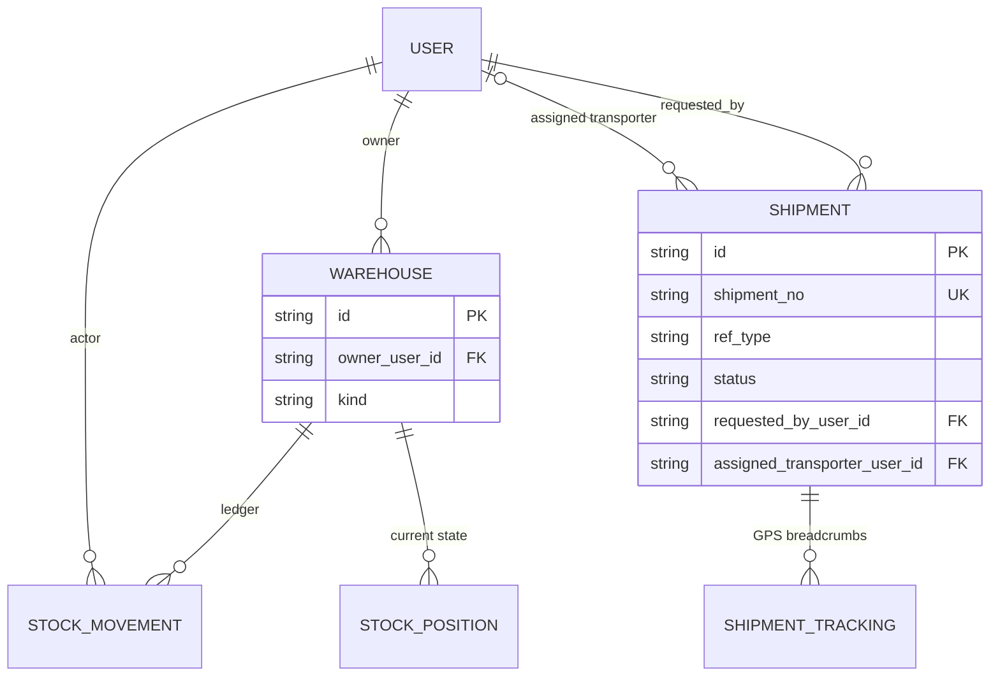
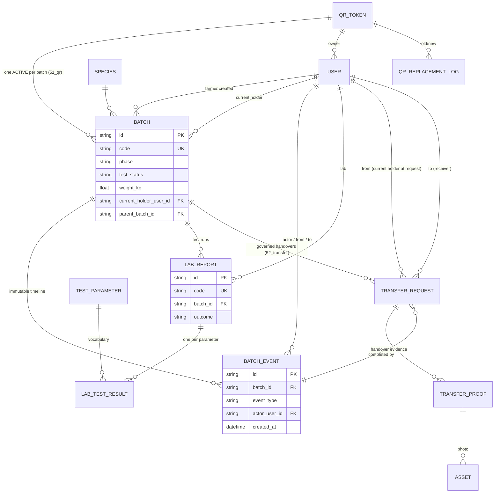
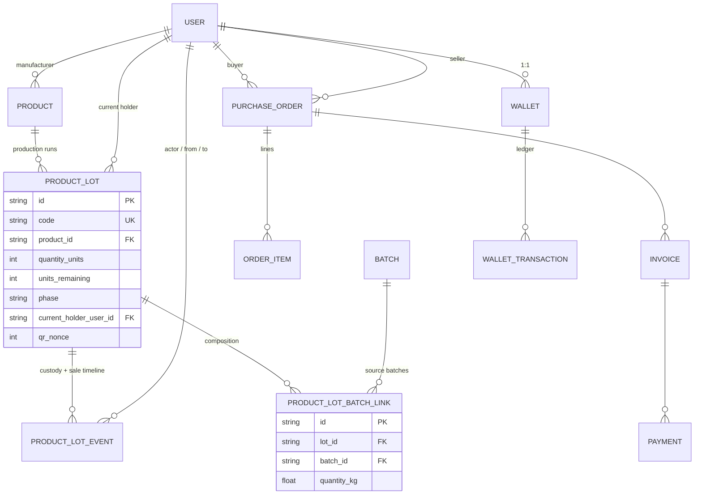
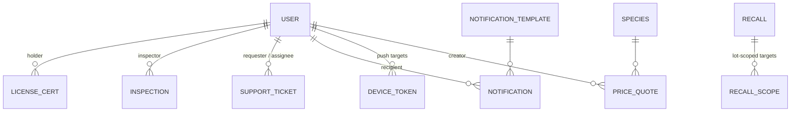

# HerbChain — ER Diagram (Redesigned Schema)

Source of truth: `prisma/schema/` (15 files, 57 models). This file renders the
same structure as Mermaid diagrams grouped by domain — the phase-1 "ER
Diagram" deliverable. Full conventions: `docs/database/architecture.md`.

Legend: `||` one, `o{` zero-or-many, `|{` exactly-one-many, `o|` zero-or-one.

Polymorphic references (plain columns, resolved in code — no FK/relation):
`EntityDocument.entity_*`, `StockMovement.ref_*`, `StockPosition.ref_*`,
`OrderItem.ref_*`, `Shipment.ref_*`, `QrScanLog.target_*`, `Recall.ref_*`,
`RecallScope.scope_*`, `Inspection.target_*`, `BlockchainEvent.entity_*`.

## 1. Identity & Security


## 2. Catalogue & Agronomy

```mermaid
erDiagram
    SPECIES ||--o{ SPECIES_SYNONYM : ""
    SPECIES ||--o{ SPECIES_CONTENT : "per locale"
    SPECIES ||--o{ SPECIES_MEDICINAL_USE : ""
    MEDICINAL_USE ||--o{ SPECIES_MEDICINAL_USE : ""
    SPECIES ||--o{ BATCH : "harvested as"
    SPECIES ||--o{ CROP_PLAN : "planted as"
    SPECIES ||--o{ PRICE_QUOTE : "priced as"
    USER ||--o{ SPECIES : "curated by"

    FARMER_PROFILE ||--o{ FARM_PLOT : "has plots"
    FARM_PLOT ||--o{ CROP_PLAN : "planting cycles"
    USER ||--o{ CROP_PLAN : "farmer owns"
    SPECIES ||--o{ CROP_PLAN : ""
    CROP_PLAN ||--o{ FARM_ACTIVITY : "activity log"
    USER ||--o{ FARM_ACTIVITY : "actor"

    FARM_PLOT o|--o{ BATCH : "grown on plot"
    CROP_PLAN o|--o{ BATCH : "from crop plan"

    SPECIES {
        string id PK
        string code UK
        string common_name
        string scientific_name
    }
    FARMER_PROFILE {
        string id PK
        string farmer_id UK FK
        string farmer_code UK
        boolean organic_certified
    }
```

## 3. Logistics (transport, warehouses, stock, shipments)



## 4. Quality, Trace & the custody spine



## 5. Products, lots & commerce



## 6. Compliance, notifications & intel



Standalone tables (no relations; polymorphic or event/feed rows):
`QrScanLog` (every QR scan — custody + consumer views), `WeatherSnapshot`
(cached provider payloads), `BlockchainEvent` (proof anchors for domain
events).
