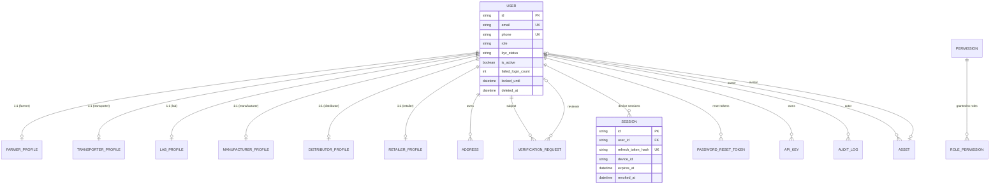
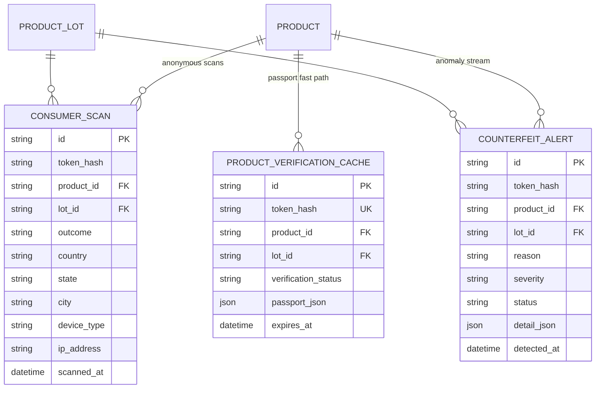
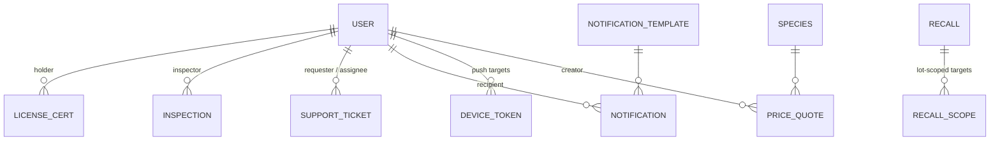
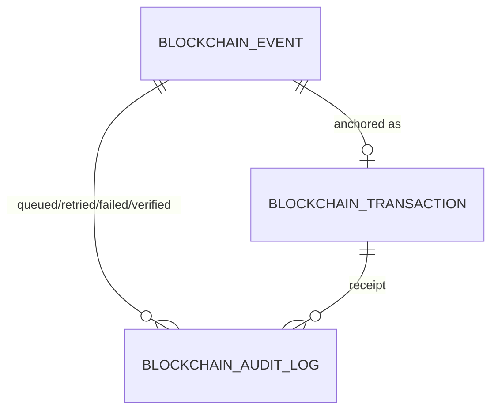
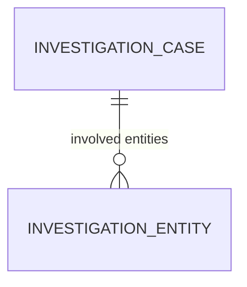

# HerbChain — ER Diagram (Redesigned Schema)

Source of truth: `prisma/schema/` (21 files, 105 models). This file renders the
same structure as Mermaid diagrams grouped by domain — the phase-1 "ER
Diagram" deliverable. Full conventions: `docs/database/architecture.md`.

Legend: `||` one, `o{` zero-or-many, `|{` exactly-one-many, `o|` zero-or-one.

Polymorphic references (plain columns, resolved in code — no FK/relation):
`EntityDocument.entity_*`, `StockMovement.ref_*`, `StockPosition.ref_*`,
`OrderItem.ref_*`, `Shipment.ref_*`, `QrScanLog.target_*`, `Recall.ref_*`,
`RecallScope.scope_*`, `Inspection.target_*`, `BlockchainEvent.entity_*`,
`ComplianceAlert.entity_*`, `InvestigationEntity.entity_*`.

## 1. Identity & Security



## 2. Catalogue & Agronomy

```mermaid
erDiagram
    SPECIES ||--o{ SPECIES_SYNONYM : ""
    SPECIES ||--o{ SPECIES_CONTENT : "per locale"
    SPECIES ||--o{ SPECIES_MEDICINAL_USE : ""
    MEDICINAL_USE ||--o{ SPECIES_MEDICINAL_USE : ""
    SPECIES ||--o{ BATCH : "harvested as"
    SPECIES ||--o{ CROP_PLAN : "planted as"
    SPECIES ||--o{ PRICE_QUOTE : "priced as"
    USER ||--o{ SPECIES : "curated by"

    FARMER_PROFILE ||--o{ FARM_PLOT : "has plots"
    FARM_PLOT ||--o{ CROP_PLAN : "planting cycles"
    USER ||--o{ CROP_PLAN : "farmer owns"
    SPECIES ||--o{ CROP_PLAN : ""
    CROP_PLAN ||--o{ FARM_ACTIVITY : "activity log"
    USER ||--o{ FARM_ACTIVITY : "actor"

    FARM_PLOT o|--o{ BATCH : "grown on plot"
    CROP_PLAN o|--o{ BATCH : "from crop plan"

    SPECIES {
        string id PK
        string code UK
        string common_name
        string scientific_name
    }
    FARMER_PROFILE {
        string id PK
        string farmer_id UK FK
        string farmer_code UK
        boolean organic_certified
    }
```

## 3. Logistics (transport, warehouses, stock, shipments)

```mermaid
erDiagram
    USER ||--o{ WAREHOUSE : "owner"
    WAREHOUSE ||--o{ STOCK_MOVEMENT : "ledger"
    WAREHOUSE ||--o{ STOCK_POSITION : "current state"
    USER ||--o{ STOCK_MOVEMENT : "actor"

    USER ||--o{ SHIPMENT : "requested_by"
    USER o|--o{ SHIPMENT : "origin / destination"
    USER o|--o{ SHIPMENT : "assigned transporter"
    SHIPMENT ||--o{ SHIPMENT_TRACKING : "GPS breadcrumbs"
    SHIPMENT ||--o{ TRANSPORTER_ASSIGNMENT : "one pending job"
    SHIPMENT ||--o{ PICKUP_EVENT : "evidence"
    SHIPMENT ||--o{ DELIVERY_EVENT : "receiver scans"
    SHIPMENT ||--o{ SHIPMENT_EVENT : "timeline"
    SHIPMENT ||--o{ SHIPMENT_DOCUMENT : "invoice / certs"
    SHIPMENT ||--o{ FAILED_DELIVERY_LOG : "why it failed"
    SHIPMENT |o--o| PROOF_OF_DELIVERY : "POD 1:1"
    SHIPMENT |o--o| SHIPMENT_METRIC : "expected vs actual"

    WAREHOUSE {
        string id PK
        string owner_user_id FK
        string kind
    }
    SHIPMENT {
        string id PK
        string shipment_no UK
        string ref_type
        string shipment_type
        string status
        string requested_by_user_id FK
        string from_user_id FK
        string to_user_id FK
        string assigned_transporter_user_id FK
        float geofence_radius_m
    }
    PICKUP_EVENT {
        string id PK
        string shipment_id FK
        float pickup_lat
        float pickup_lng
        string photo_url
        datetime pickup_time
    }
    DELIVERY_EVENT {
        string id PK
        string shipment_id FK
        string receiver_user_id FK
        string receiver_role
        float delivery_lat
        float delivery_lng
    }
    PROOF_OF_DELIVERY {
        string id PK
        string shipment_id FK UK
        string receiver_name
        string receiver_signature
        string receiver_photo_url
        string delivery_photo_url
        string remarks
    }
    SHIPMENT_EVENT {
        string id PK
        string shipment_id FK
        string event_type
        json event_data
        string created_by_user_id FK
        datetime created_at
    }
    SHIPMENT_METRIC {
        string id PK
        string shipment_id FK UK
        float expected_hours
        float actual_hours
        int delay_minutes
    }
```

## 4. Quality, Trace & the custody spine

```mermaid
erDiagram
    USER ||--o{ BATCH : "farmer created"
    USER ||--o{ BATCH : "current holder"
    SPECIES ||--o{ BATCH : ""
    BATCH ||--o{ BATCH_EVENT : "immutable timeline"
    USER ||--o{ BATCH_EVENT : "actor / from / to"

    BATCH |o--o| LAB_RECEIPT : "intake checklist"
    BATCH ||--o{ SAMPLE_RECORD : "samples drawn"
    SAMPLE_RECORD ||--o{ LAB_TEST : "test runs"
    LAB_TEST ||--o{ LAB_TEST_RESULT : "one per parameter"
    TEST_PARAMETER ||--o{ LAB_TEST_RESULT : "vocabulary"
    LAB_TEST ||--o{ LAB_REVIEW : "supervisor two-level review"
    BATCH ||--o{ LAB_DOCUMENT : "reports / COA PDFs"
    BATCH ||--o{ SPECIES_VERIFICATION_LOG : "farmer vs AI vs lab"
    BATCH |o--o| CERTIFICATION : "COA (sha256)"
    BATCH |o--o| REJECTION_RECORD : "why it failed"

    BATCH {
        string id PK
        string code UK
        string phase
        string test_status
        float weight_kg
        string current_holder_user_id FK
        string parent_batch_id FK
    }
    QR_TOKEN ||--o{ BATCH : "one ACTIVE per batch (51_qr)"
    QR_TOKEN ||--o{ USER : "owner"
    QR_TOKEN ||--o{ QR_REPLACEMENT_LOG : "old/new"
    BATCH ||--o{ TRANSFER_REQUEST : "governed handovers (52_transfer)"
    USER ||--o{ TRANSFER_REQUEST : "from (current holder at request)"
    USER ||--o{ TRANSFER_REQUEST : "to (receiver)"
    TRANSFER_REQUEST ||--o{ TRANSFER_PROOF : "handover evidence"
    TRANSFER_REQUEST }o--|| BATCH_EVENT : "completed by"
    TRANSFER_PROOF ||--o{ ASSET : "photo"
    BATCH_EVENT {
        string id PK
        string batch_id FK
        string event_type
        string actor_user_id FK
        datetime created_at
    }
    LAB_RECEIPT {
        string id PK
        string batch_id FK UK
        string condition_status
        float received_quantity_kg
    }
    SAMPLE_RECORD {
        string id PK
        string sample_code UK
        string batch_id FK
        float sample_weight_kg
    }
    LAB_TEST {
        string id PK
        string batch_id FK
        string sample_id FK
        string test_category
        string status
        string outcome
    }
    LAB_TEST_RESULT {
        string id PK
        string test_id FK
        string parameter_id FK
        float observed_value_numeric
        string result
    }
    LAB_REVIEW {
        string id PK
        string test_id FK
        string review_status
        string reviewed_by_user_id FK
    }
    CERTIFICATION {
        string id PK
        string certificate_number UK
        string batch_id FK UK
        string certificate_hash
        int pass_count
        string status
    }
    REJECTION_RECORD {
        string id PK
        string batch_id FK UK
        string reason
        string action
    }
```

## 5. Procurement (manufacturer raw-material intake, Phase 9)

```mermaid
erDiagram
    BATCH ||--o{ BATCH_REQUEST : "procurable when certified + cert valid"
    USER ||--o{ BATCH_REQUEST : "manufacturer"
    BATCH_REQUEST |o--o| INVENTORY_ALLOCATION : "reserved qty (anti-oversell)"
    BATCH_REQUEST |o--o| SHIPMENT : "auto-created on approval"
    BATCH_REQUEST ||--o{ GOODS_RECEIPT : "GRN at intake"
    BATCH |o--o| BATCH_INVENTORY : "availability pool at the holder"
    BATCH ||--o{ INVENTORY_ITEM : "per receiving manufacturer"
    INVENTORY_ITEM ||--o{ INVENTORY_TRANSACTION : "append-only ledger"
    BATCH ||--o{ QUALITY_HOLD : "quarantine (active blocks production)"

    BATCH_REQUEST {
        string id PK
        string request_no UK
        string manufacturer_user_id FK
        string batch_id FK
        float requested_quantity_kg
        float approved_quantity_kg
        string status
    }
    BATCH_INVENTORY {
        string id PK
        string batch_id FK UK
        float total_quantity_kg
        float available_quantity_kg
        float reserved_quantity_kg
        float consumed_quantity_kg
    }
    INVENTORY_ALLOCATION {
        string id PK
        string batch_id FK
        string request_id FK UK
        float allocated_quantity_kg
        string status
    }
    GOODS_RECEIPT {
        string id PK
        string grn_number UK
        string manufacturer_user_id FK
        string batch_id FK
        string shipment_id FK
        float accepted_quantity_kg
        float rejected_quantity_kg
    }
    INVENTORY_ITEM {
        string id PK
        string manufacturer_user_id FK
        string batch_id FK
        float available_quantity_kg
        float reserved_quantity_kg
        float consumed_quantity_kg
        float discarded_quantity_kg
    }
    INVENTORY_TRANSACTION {
        string id PK
        string inventory_id FK
        string transaction_type
        float quantity_kg
    }
    QUALITY_HOLD {
        string id PK
        string batch_id FK
        string manufacturer_user_id FK
        string reason
        string status
    }
```

## 6. Products, manufacturing & lineage (Phase 10) + commerce

```mermaid
erDiagram
    USER ||--o{ PRODUCT : "manufacturer"
    PRODUCT ||--o{ MANUFACTURING_BATCH : "production runs (MFG)"
    PRODUCT ||--o{ PRODUCT_FORMULA : "standard recipe lines"
    SPECIES ||--o{ PRODUCT_FORMULA : "ingredient species"
    MANUFACTURING_BATCH ||--o{ MANUFACTURING_BATCH_INGREDIENT : "reserved -> consumed | released"
    BATCH ||--o{ MANUFACTURING_BATCH_INGREDIENT : "source herb batch"
    INVENTORY_ITEM ||--o{ MANUFACTURING_BATCH_INGREDIENT : "reserved quantity (Phase 9 pool)"
    PRODUCT ||--o{ PRODUCT_LOT : "finished lots"
    USER ||--o{ PRODUCT_LOT : "current holder"
    MANUFACTURING_BATCH |o--o| PRODUCT_LOT : "one lot per completed run"
    PRODUCT_LOT ||--o| PRODUCT_QR_TOKEN : "permanent (hash + cipher)"
    PRODUCT_LOT ||--o{ PRODUCT_LOT_EVENT : "custody + sale timeline"
    USER ||--o{ PRODUCT_LOT_EVENT : "actor / from / to"
    PRODUCT_LOT ||--o{ PRODUCT_LINEAGE_SNAPSHOT : "frozen at completion"
    BATCH ||--o{ AFFECTED_PRODUCT : "recall blast radius"
    PRODUCT ||--o{ AFFECTED_PRODUCT : ""

    USER ||--o{ PURCHASE_ORDER : "buyer"
    USER ||--o{ PURCHASE_ORDER : "seller"
    PURCHASE_ORDER ||--o{ ORDER_ITEM : "lines"
    PURCHASE_ORDER ||--o{ INVOICE : ""
    INVOICE ||--o{ PAYMENT : ""
    USER ||--o{ WALLET : "1:1"
    WALLET ||--o{ WALLET_TRANSACTION : "ledger"

    PRODUCT {
        string id PK
        string code UK
        string manufacturer_user_id FK
        string status
        string verification_status
        int expiry_months
    }
    MANUFACTURING_BATCH {
        string id PK
        string code UK
        string product_id FK
        string manufacturer_user_id FK
        string status
        int planned_units
    }
    MANUFACTURING_BATCH_INGREDIENT {
        string id PK
        string manufacturing_batch_id FK
        string batch_id FK
        string inventory_item_id FK
        float quantity_kg
        string state
    }
    PRODUCT_FORMULA {
        string id PK
        string product_id FK
        string species_code FK
        float standard_quantity
        string unit
    }
    PRODUCT_LOT {
        string id PK
        string code UK
        string product_id FK
        string manufacturing_batch_id FK
        int quantity_units
        int units_remaining
        string phase
        string current_holder_user_id FK
    }
    PRODUCT_QR_TOKEN {
        string id PK
        string lot_id FK UK
        string token_hash UK
        string token_cipher
        string status
    }
    PRODUCT_LINEAGE_SNAPSHOT {
        string id PK
        string product_id FK
        string lot_id FK
        string snapshot_hash
    }
    AFFECTED_PRODUCT {
        string id PK
        string batch_id FK
        string product_id FK
        string impact_type
        string status
    }
```

## 7. Consumer verification portal (Phase 11)



Privacy + security controls (docs/verification/architecture.md): the passport
never exposes internal ids, emails, phones, addresses or financial data; raw
QR tokens are never stored (hash lookup); `ConsumerScan` keeps only coarse geo
+ device facets; public endpoints are rate-limited per IP and the passport
cache is purged on recall.

## 8. Compliance, notifications & intel



Standalone tables (no relations; polymorphic or event/feed rows):
`QrScanLog` (every QR scan — custody + consumer views), `WeatherSnapshot`
(cached provider payloads). The blockchain tables (§9) are relation-free
by design — the queue rows reference domain entities via plain FK columns
(`entity_type` + `entity_id`), never via relations.

## 9. Blockchain trust layer (Phase 12)



`BlockchainEvent` is the **event queue** — every domain milestone
(BATCH_CREATED, TRANSFERRED, RECEIVED, CERTIFIED, PRODUCT_CREATED, LINKED,
MATERIAL_RECEIVED, …) is written `pending` inside the domain transaction;
the worker never blocks the API. Rows flow `pending → processing →
completed | failed` with attempts, exponential backoff (`next_attempt_at`)
and `performed_by_user_id`. `BlockchainTransaction` is the hash-linked
ledger block (`prev_hash`, `payload_hash` = SHA-256 of the canonical live
facts, monotonic `block_number`, `confirmed_at`) — the database stays the
system of record and the chain is recomputable for tamper detection
(VALID | TAMPERED). `BlockchainNode` seeds the permissioned network
(AYUSH governance, regional authority, labs, manufacturer, orderer),
`SmartContractVersion` ships contract functions + security rules 1–5 that
the worker enforces as a defense-in-depth gate, and `BlockchainAuditLog`
records every queue/txn action for the AYUSH audit trail.

## 10. AYUSH regulatory monitoring (Phase 13)



`ComplianceAlert` is the centralized risk stream — raised by the rules
engine (repeated batch failures, species fraud, invalid transfers,
duplicate registrations, suspicious QR scans, recall events, certificate
expiry, high lab pass rates) and by admin actions, with
`severity LOW | MEDIUM | HIGH | CRITICAL` and `open | acknowledged |
resolved` lifecycle. `InvestigationCase` (INV-…) carries an ordered set of
`InvestigationEntity` rows (subject / witness / affected) for complaints,
fraud, recalls and audits. `ComplianceScore` persists the 0–100 entity
score + grade + factor breakdown (certification success, mismatches,
violations, recalls, timeliness). `AdminNotification` is the AYUSH feed
(broadcast or per-admin; recall events, high-severity alerts, new lab
registrations). `ReportExport` records regulatory report jobs — CSV is
exported live through the storage driver, pdf/excel are pipeline slots.
Recalls use the extended `Recall.status` code list (draft | issued |
active | resolved | closed) and the recall center auto-scopes
`RecallScope` rows + `AffectedProduct` impacts.
